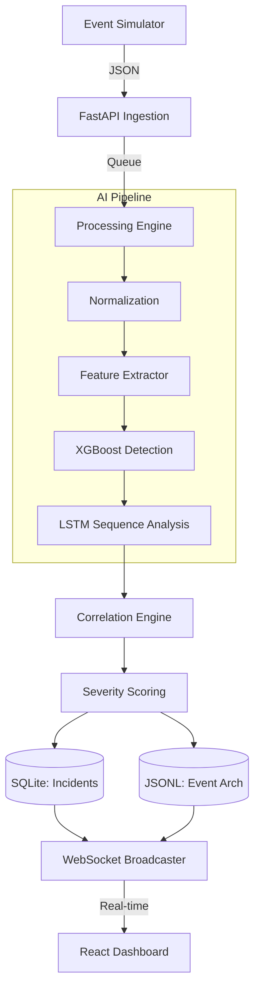

# 🛡️ Log Guardian: AI-Powered SOC Suite

[](https://fastapi.tiangolo.com/)
[](https://reactjs.org/)
[](https://xgboost.readthedocs.io/)
[](https://opensource.org/licenses/MIT)

**Log Guardian** is a high-performance, lightweight SOC (Security Operations Center) pipeline engineered for real-time threat detection and incident response. It combines modern web technologies with deep learning models to process thousands of security events locally with minimal overhead.

---

## ✨ Key Features

-   **⚡ Real-Time Pipeline**: Asynchronous event ingestion using Python Queues and `asyncio` broadcaster.
-   **🧠 Dual-Stage ML Detection**: 
    -   **Stage 1**: XGBoost for high-speed signature-based anomaly detection.
    -   **Stage 2**: Bi-LSTM (PyTorch) for sequential analysis of attack patterns.
-   **📊 Modern Dashboard**: Polished React interface with live data streaming via WebSockets.
-   **🛠️ Zero External Deps**: Runs entirely locally using **SQLite** and **JSONL** persistence—no Kafka or Elasticsearch required.
-   **🚨 Incident Management**: Automated correlation engine that groups related events into actionable incidents.

---

## 🏗️ System Architecture



---

## 🚀 Getting Started

### 1. Backend Engine
```bash
# Clone the repository
cd "Log Guardian/log guardian"

# Install dependencies
pip install -r requirements.txt

# Start the core engine
python main.py
```
> **Backend URL**: [http://localhost:8000](http://localhost:8000)  
> **API Docs**: [http://localhost:8000/docs](http://localhost:8000/docs)

### 2. Monitoring Dashboard
```bash
cd frontend
npm install
npm run dev
```
> **Dashboard URL**: [http://localhost:5173](http://localhost:5173)

---

## 🧪 Simulation & Testing

To see the AI models identify threats in real-time, you can trigger a high-volume attack simulation:

**via PowerShell:**
```powershell
Invoke-RestMethod -Uri "http://localhost:8000/api/simulate" -Method Post -Body '{"num_events": 1000}' -ContentType "application/json"
```

**via CURL:**
```bash
curl -X POST http://localhost:8000/api/simulate -H "Content-Type: application/json" -d '{"num_events": 1000}'
```

---

## 📂 Project Organization

| Directory | Purpose |
| :--- | :--- |
| `api/` | FastAPI routes, Auth, and WebSocket logic |
| `detection/` | Inference engines (XGBoost & LSTM) |
| `processing/` | Normalization and real-time Feature Engineering |
| `correlation/` | Logic for grouping events into high-level Incidents |
| `storage/` | Lightweight persistence drivers (SQLite/JSON) |
| `frontend/` | React source code and Vite configuration |

---

## 🛡️ Security Note
This "Local Edition" is designed for demonstration and educational purposes. Sensitive files like `soc.db`, `events.json`, and local model binaries are excluded from version control via `.gitignore` to maintain environment cleanliness.

---

© 2026 Log Guardian Team. Built for modern security engineering.
